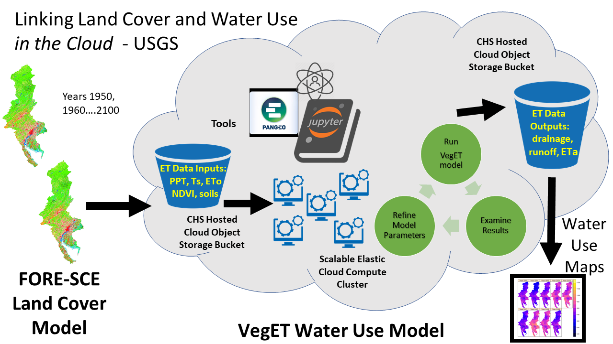

<u> charter</u>

# ET Case Study Project Charter



## Prior Art
### Science Focused Detailed Training


# Jupyter For Everything
## Technology Musts
You must use these:

### These have been selected with prejudice from over 40 years of playing with tech!
- These have been selected with prejudice from over 40 years of playing with tech!

#### Key Technologies that Allow Scaling

    ## AWS Cloud
    #### Linux/Terraform
    #### Docker
    ## Jupyter
    #### PANGEO, Open Data Cube and The BROWSER
    #### Python and github

### Xarray
- learning this is necessary for any data scientist
- the devops and python geeks can deliver you your pixels and metadata in an xarray
- BUT the xarray and above is where the science happens - technogeeks no do no science.
- Many of the next breakthroughs in science will be showcased with an xarray backbone

### Visualization Python Libraries
- Dashboards


### ET Case Introduction: 

- The (evaporation) ET Science Team has successfully demonstrated the ability to globally scale their models using cloud platforms. Notably Google Earth Engine.
	- However there are trade-offs and some disincentives for continuing to use GEE.
	- AWS will soon house the Landsat Collection-2 data set and allow direct access to pixels, metadata and pixelqa data.
	- This environment should lead to efficiencies in creating ET products and this research project seeks to explore and document these efficiencies.

- Cloud computing offers many attractive features for cost effective processing of Embarrassingly Parallel Algorithms 
	- It is assumed or known that ET models allow for a parallel processing model.

```
NOTE: we need to document the contrasting approaches and some of the policies of GEE versus Open Source and AWS.

also consider govt contracts that include M$ Azure etc.
```

> A project charter is a formal project authorization which documents the shared understanding of a project’s scope, development, and objectives, while also defining the roles and responsibilities of each party involved.


### General Project Statement

This project will provide comprehensive and sometimes custom training to any or all USGS/EROS Science Teams and Individuals.

### Concept

The goal is to build a curriculum and code examples for spring-boarding projects into the AWS cloud.

Learn and apply lessons from the ET Case Study
System is defined to be the ET model system ( Data, Code, Infrastructure, and Monitoring) subcomponents.

- The system shall run in AWS
- The system shall run in pangeo binder sandboxes
- The system shall exploit COGS and STAC when they become available
- OpenDataCube will be evaluated as a possible principle component/middle-ware/python-library

### Scope: 
- unique project characteristics

1. This system must run in the CHS (Cloud Hosting Service) specific AWS cloud implementations and function under any security induced constraints apparent in this environment.

2. This system should be able flexible and in some cases use other sensor data in lieu of the data used to prototype the system.

### Success Criteria: 

1. The architecture choices and code base used for the prototype ET modeling application should directly map to a routine, periodic, production capability that leverages cloud services and exports products in an easily exploitable way.

### Business Case;  The BIG WHY!

### Population Growth and Better Resource Management

1. "There are more human beings on the earth than have ever died"
    - This leads to resource shortages and implications for humanity.

2. Resources need to be managed
    - Laws and governance must create efficient use of land and water.


### Simplifying Science by Simplifying Data Access and Exploitation

3. Mapping Remote Sensing Data into usable information is paramount to charting resource scarcities and abundances.
    - Jupyter notebooks are becoming a game-changing approach for presenting science findings
    - Convincing some of the people governing countries will require clear presentations of the facts of global change.

4. Cloud computing is revolutionizing data lakes and immediate scalable processing

> He who has a why to live can bear almost any how. -- Friedrich Nietzsche

### ET Scientists have a willingness to Exploit Cloud Platforms
1. The PANGEO Sandbox Model is interesting enough to the ET project to explore
2. The USGS is also exploring PANGEO incubation environments
3. Collection-2 will live in the cloud in Oregon - we need to understand this new Landsat Data Access Model.

### Key Calendar Event Watch

1. Jupyter Pangeo Workshop 1 - Pieschke/Roberts - December 2019
3. Persistent Pangeo Sandbox (CHS Hosted) (EarthMap Funded) February 11, 2019
2. Open Data Cube Annual Hackathon - February 2020 in Canberra, Australia
3. ET Pangeo Project Kickoff `[THIS PROJECT]` - February 2020
4. USGS -- GeoScience Annual Planning and Collaboration Group - big wigs pontificate - April 26-30, Annapolis MD. `[Doucette, Labahn, Jenn Lacey, Butzer]`
5. PANGEO/pangeo.chs.usgs.gov open for use -- **May 1, 2020** - thanks Rich
5. Collection-2 Public Release with STAC catalog and STAC API/Service - May 15, 2020
6. Open Data Cube Science Workshop at EROS - hosted by Alex Leith and CEOS's Brian Killough - June 15, 2020 `[Jupyter, AWS, ODC, Collection-2 DEEP DIVE]` **postponed COVID-style**

### Code Packaging and Evaluation ET example

	- Initial github repo 
	- Organizing the parts in to libraries
		- et-model-lib
		- et-data-xfer-lib
		- ODC(libraries)
		- GDAL stuff
		- xarrays, numpy, matplot, seaborn ... ... ...


### Jupyter Hub Infrastructure mini-pangeo construction

- Building an infrastructure test-bed
	- jupyter labs, notebook and hub capable


## ET Staff Contact List

```bash

Gabriel Senay
Co-Principle Investigator
U.S. Geological Survey (USGS), Earth Resources Observation and Science (EROS) Center, 
North Central Climate Adaptation Science Center, 
Fort Collins, CO, USA
senay@usgs.gov
 
Stefanie Kagone
Research Scientist
ASRC Federal Data Solutions LLC, Contractor to the U.S. Geological Survey EROS Center, 
Sioux Falls, SD, 57198, USA 
skagone@contractor.usgs.gov
 
Darin Schulte PhD, MLA
Research Scientist
Natural Resources Ecology Laboratory
Colorado State University
darin.schulte@colostate.edu
 
Gabe Parrish
Remote Sensing Scientist
Innovate!, Inc., TSSC Contractor to the U.S. Geological Survey EROS Center, 
Sioux Falls, SD 57198
gparrish@contractor.usgs.gov


Tony Butzer
OpenDataCube Cloud Engineer
KBR - Sioux Falls
butzer@contractor.usgs.gov
```


### Tony Butzer - Open Data Cube Cloud Engineer

1. DevOps and Infrastructure
2. Python code builds and docker containers
3. Docker Orchestration
4. Open Source Agile Development Methods
5. Open Data Cube experience and liaison to higher level engineers in ODC
6. Cloud computing enthusiast
7. Loyal EROS employee since the 80's


### Major Requirements for mini-pangeos

1. Supports Science Hackathons
2. Highly repeatable
3. Easy up and down
4. Documented and deployed as code (codified in CFT and/or Terraform)

### Deliverables: 

1. December 1 - AWS Onboarding - Hosted/Genesis by Neal Pastick


#### Cloud Examples from github - treasure chest
	- terraform examples
	- ipynb files
	- tools for installing python libraries
	-
2. Web based project documentation
3. EKS cluster in the dev environment - move to deployment - this focus is on science development environments
4. Jupyterhub Container/Pod/Service - focus on pure docker - skip the complicated abstractions in K8s
5. JupyterNotebook Container/Pod/Service


### Budget: 
- cost estimate, information about spending authority

### Constraints and Assumptions: 

1. Funded as part of LSAA and OpenDataCube and Science (Doucette) 
	- initial incubation - not an issue - if the story is compelling - long term will not be an issue either


### Stakeholders

1. ET Team of Excellence
1. Government Program Managers
	- Steve Labahn
	- Kristi Kline
	- Pete Doucette
2. Intervening Managers and Government Customers
	- to be determined or perhaps to be ignored
2. Enterprise Architect - Randy Sunne
3. Data Scientist and Data Engineer - Renee Pieschke
4. Science liaison
3. Development Team (N/A)
4. Cloud Team (DevOps?)

- what are the project’s known and unknown parameters at this point in time?

### Summary of Risks: 
- a high-level overview of major threats to the project’s success

1. Kubernetes is very complicated
2. Security Items will need to be addressed - likely in stages
3. Attention Span risk - the amount of work and the pace of change can vector resources in unexpected ways.

    
### Communication plan: 
- this includes details about how each person involved will be kept informed about progress, changes, etc. (Here’s how to create a communication plan)

1. Perhaps 1 hour training sessions weekly or every fortnight
3. more to be defined ....
